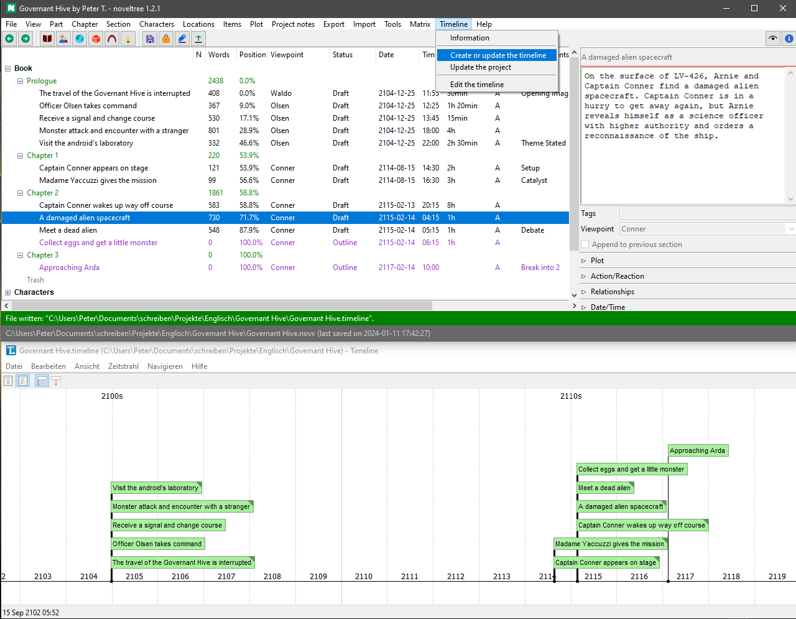

# nv_timeline

The [noveltree](https://github.com/peter88213/noveltree/) Python program helps authors organize novels.  

The *nv_timeline* plugin synchronizes noveltree projects with [Timeline](http://thetimelineproj.sourceforge.net/).

## Features

- Create a timeline from a *noveltree* project.
- Create a new *noveltree* project from a timeline.
- Synchronize *noveltree* sections with corresponding timeline events in both directions.

## Requirements

- [Timeline 2.4+](https://sourceforge.net/projects/thetimelineproj/). Versions below 2.4 do not support labels, which are necessary for synchronization with yWriter.
- [noveltree](https://github.com/peter88213/noveltree/) version 1.8+

## Download and install

[Download the latest release (version 1.1.0)](https://github.com/peter88213/nv_timeline/raw/main/dist/nv_timeline_v1.1.0.zip)

- Extract the "nv_timeline_v1.1.0" folder from the downloaded zipfile "nv_timeline_v1.1.0.zip".
- Move into this new folder and launch **setup.pyw**. This installs the plugin for the local user.

---

[Changelog](docs/changelog.md)

## Usage and conventions

See the [instructions for use](docs/usage.md)

## License

This is Open Source software, and the *nv_timeline* plugin is licensed under GPLv3. See the
[GNU General Public License website](https://www.gnu.org/licenses/gpl-3.0.en.html) for more
details, or consult the [LICENSE](https://github.com/peter88213/nv_timeline/blob/main/LICENSE) file.

 

