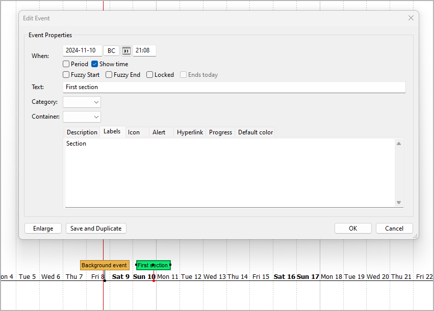

[Project homepage](https://github.com/peter88213/nv_timeline) > [Index](../) > User guide

[Deutsch](../help_de/)

------------------------------------------------------------------------

# User guide

This page refers to the latest
[nv_timeline](https://github.com/peter88213/nv_timeline/) release. You
can open it with **Help > Timeline plugin Online help**.

The plugin adds a **Timeline** entry to the *novelibre* **Tools** menu,
a **Create from Timeline\...** to the **File > New** submenu, and a
**Timeline plugin Online Help** entry to the **Help** menu. The Toolbar
gets a  button.

## Command reference

### Tools > Timeline > Information

-   Show information about an existing *Timeline* project, if any.
    *Timeline* and *novelibre* file dates are compared.

### Tools > Timeline > Create or update the timeline

If a timeline exists, update it from *novelibre*, otherwise create a new
timeline.

### Tools > Timeline > Update the project

Update the *novelibre* project from the timeline, if existing.

---

**Important**

Please make sure to save the timeline before trying to sync with
*novelibre*. Since *nv_timeline* reads the .timeline file, unsaved
changes may not be recognized. In case of doubt, close *Timeline* before
syncing with *novelibre*.

---

### Tools > Timeline > Open Timeline

Same as clicking on the  button on the
toolbar.

Open the project's timeline, if existing, with the *Timeline*
application. Depending on the configuration (see below), the project is
automatically locked.

### File > New > Create from Timeline\...

Open a file dialog to select a timeline. If no *novelibre* project with
the timeline's file name exists, create a new one from the timeline.

---

**Hint**

To become sections in *novelibre*, *Timeline* Events need a "Section"
label.



The idea behind this is that only selected events should be included as
sections in the *novelibre* project. There may also be background
events, for example, that should not be synchronized.

---

## Custom configuration

You can override the default settings by providing a configuration file.
Be always aware that faulty entries may cause program errors or
unreadable *Timeline* projects. If you change a configuration inbetween,
previously synchronized projects might no longer match.

### Global configuration

An optional global configuration file named `nv_timeline.ini` can be
placed in the configuration directory of the installation. It is applied
to any project. Its entries override *nv_timeline's* built-in constants.
This is the path under Windows:
`c:\Users\<user name>\.novx\config\nv_timeline.ini`

### Local project configuration

An optional project configuration file named `nv_timeline.ini` can be
placed in your project directory, i.e. the folder containing your
*novelibre* and *Timeline* project files. It is only applied to this
project. Its entries override *nv_timeline's* built-in constants as well
as the global configuration, if any.

### How to provide/modify a configuration file

You find the a sample configuration file with the *nv_timeline* default
values in the *novelibre* installation directory under

`c:\Users\<user name>\.novx\nv_timeline_sample\`

You best make a copy and edit it.

-   The SETTINGS section comprises the program "constants". If you
    change them, the program might behave differently than described in
    the documentation. So only touch them if you are clear about the
    consequences.
-   Comment lines begin with a `#` number sign. In the example, they
    refer to the code line immediately above.

This is the configuration file explained:

```ini

[SETTINGS]

section_label = Section

# Events with this label become sections in a newly created 
# novelibre project. 

section_color = 170,240,160

# Color for events imported as sections from novelibre.

new_event_spacing = 1

# Days between events with automatically generated dates.  


[OPTIONS]

lock_on_export = No

# Yes: Lock the novelibre project when opening the timeline.
# No: Do not lock the novelibre project when opening the timeline.

```


### How to reset the configuration to defaults

Just delete your global and local configuration files.

## Conventions

### General

-   The *novelibre* project file and the *Timeline* file are located in
    the same directory.
-   They have the same file name and differ in the file extension.
-   Either a timeline or a *novelibre* project is generated from the
    other file for the first time. After that, the two files can be
    synchronized against each other.

---

**Caution**

Synchronizing means overwriting target data with source data. Since
*nv_timeline* works in both directions, there is always a danger of
confusing source and target, thus losing changes. So if the program asks
you for confirmation to overwrite a file, better check if it's actually
the target file.

---

### On the novelibre side

-   Only normal sections are synchronized with *Timeline*, or exported
    to *Timeline*. Unused sections will not show up in the timeline.
-   Sections with an unspecific time stamp (day, hours, minutes) are
    synchronized with the timeline, if a reference date is set.
-   Changes to the section date/time affect the event start date/time
    during synchronization.
-   Changes to the section duration affect the event end date/time
    during synchronization.
-   Changes to the section title affect the event text during
    synchronization.
-   Changes to the section description affect the event description
    during synchronization.
-   Changes to the section type may add or remove the corresponding
    event during synchronization.
-   Adding or removing sections will add or remove the corresponding
    event during synchronization.

### On the Timeline side

-   A section ID is a string looking like "sc1". It is auto-generated
    and must not be changed manually.
-   Only events with a label containing the string "Section" (user
    input) or a section ID (auto-generated) are exported as sections to
    a new *novelibre* project.
-   When creating a new *novelibre* project from a timeline the first
    time, "Section" labels are replaced with section ID labels.
-   If a new *novelibre* project is generated again with the same
    timeline, the section ID labels may change.
-   Only events with a label containing a section ID are synchronized
    with an existing *novelibre* project.
-   Changes to the event end date/time affect the section duration
    during synchronization.
-   Changes to the event start date/time affect the section date/time
    during synchronization.
-   Changes to the event text affect the section title during
    synchronization.
-   Changes to the event description affect the section description
    during synchronization.
-   The section structure of an existing *novelibre* project can not be
    changed in *Timeline*. Adding/removing events, or adding/removing
    section IDs from event labels will *not* add or remove the
    corresponding section during synchronization.
-   When creating events from sections without date/time information,
    the dates are automatically generated with a one-day difference,
    starting from the *novelibre* project's reference date.

### Known limitations

-   Section events that begin before 0001-01-01 in the timeline, will
    not be synchronized with *novelibre*, because *novelibre* can not
    handle these dates.
-   The same applies to the section duration in this case, i.e. the
    event duration in *Timeline* and the section duration in *novelibre*
    may differ.
-   If a section event ends after 9999-12-31 in the timeline, the
    section duration is not synchronized with *novelibre*.

---

Copyright (c) 2025 by Peter Triesberger. All rights reserved.
