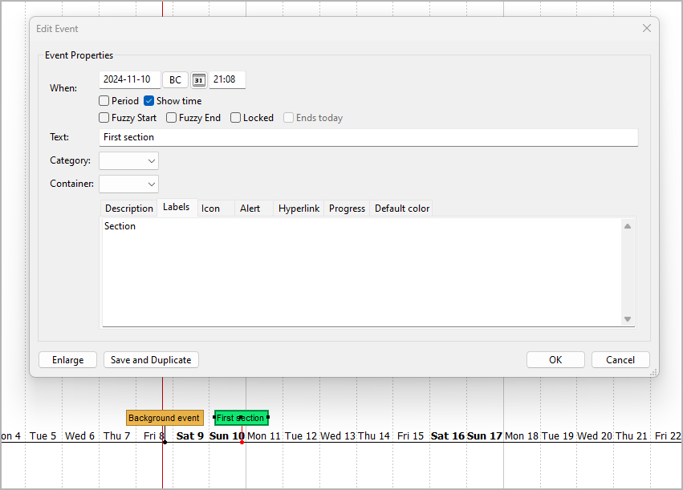

[Projekt-Homepage](https://github.com/peter88213/nv_timeline) > [Index](../) > Help

[English](../help/)

------------------------------------------------------------------------

# nv_timeline Benutzerhandbuch

Diese Seite gilt für die neueste Ausgabe von
[nv_timeline](https://github.com/peter88213/nv_timeline/). Sie können
sie mit **Hilfe > Timeline-Plugin Online-Hilfe** öffnen.

Das Plugin fügt dem *novelibre*-**Extras**-Menü den Eintrag **Timeline**
hinzu, außerdem dem **Datei > Neu**-Untermenü den Eintrag **Aus
Timeline erzeugen\...**, und dem **Hilfe**-Menü den Eintrag
**Timeline-Plugin Online-Hilfe**. Die Werkzeugleiste erhält eine
 Schaltfläche.

## Befehlsreferenz

### Extras > Timeline > Information

Damit bekommen Sie Informationen über ein bestehendes *Timeline*-Projekt
angezeigt, falls vorhanden. Das Dateidatum des *Timeline*- wird mit dem
des *novelibre*-Projekts verglichen.

### Extras > Timeline > Den Zeitstrahl erzeugen oder aktualisieren

Damit wird ein existierender Zeitstrahl aus dem *novelibre*-Projekt
aktualisiert. Ein fehlender Zeitstrahl wird neu erzeugt.

### Extras > Timeline > Das Projekt aktualisieren

Damit wird das *novelibre*-Projekt aus einem existierenden Zeitstrahl
aktualisiert.

---

**Wichtig**

Vergessen Sie nicht, den Zeitstrahl vor dem Synchronisieren mit
*novelibre* abzuspeichern. Da *nv_timeline* die *.timeline*-Datei liest,
bleiben ungesicherte Änderungen unberücksichtigt. Im Zweifelsfall
beenden Sie *Timeline*, bevor Sie mit *novelibre* synchronisieren.

---

### Extras > Timeline > Timeline öffnen

Oder in der Werkzeugleiste auf die die Schaltfläche
 klicken.

Den Zeitstrahl zum Projekt mit *Timeline* öffnen, falls vorhanden. Je
nach Konfiguration (siehe unten) wird das Projekt automatisch gesperrt.

### Datei > Neu > Aus Timeline erzeugen\...

Damit öffnen Sie einen Dateiauswahldialog, um eine *.timeline*-Datei
auszuwählen. Falls noch kein *novelibre*-Projekt mit dem gleichen
Dateinamen existiert, wird das aktuelle Projekt geschlossen und ein
neues aus dem Zeitstrahl erzeugt.

---

**Hinweis**

Um in *novelibre* zu Abschnitten zu werden, benötigen
*Timeline*-Ereignisse ein Label „Section".



Die Idee dahinter ist, dass nur ausgewählte Ereignisse als Abschnitte in
das *novelibre*-Projekt aufgenommen werden sollen. Es kann z. B. auch
Hintergrundereignisse geben, die nicht synchronisiert werden sollen.

---

## Benutzerdefinierte Konfiguration

Sie können die Voreinstellungen mit Hilfe einer Konfigurationsdatei
überschreiben. Denken Sie aber immer daran, dass fehlerhafte Einträge zu
Programmstörungen oder unlesbaren *Timeline*-Projekten führen können.
Falls Sie zwischendurch eine Konfiguration ändern, können zuvor
synchronisierte Projekte eventuell nicht mehr zusammenpassen.

### Globale Konfiguration

Sie können eine optionale globale Konfigurationsdatei namens
`nv_timeline.ini` im Konfigurationsverzeichnis der Installation ablegen.
Sie wird auf jedes Projekt angewendet. Ihre Einträge überschreiben die
Voreinstellungen von *nv_timeline*. Dies ist der Pfad unter Windows:
`c:\Users\<user name>\.novx\config\nv_timeline.ini`

### Lokale Projektkonfiguration

Sie können eine optionale Projekt-Konfigurationsdatei namens
`nv_timeline.ini` in Ihrem Projektverzeichnis ablegen, d.h. in dem
Ordner, der Ihre *novelibre*- und *Timeline*-Projektdateien enthält. Sie
gilt dann nur für das Projekt. Ihre Einträge überschreiben sowohl die
Voreinstellungen von *nv_timeline* als auch die globale Konfiguration,
falls vorhanden.

### Wie man eine Konfigurationsdatei erstellt oder anpasst

Sie finden eine Musterkonfigurationsdatei mit den voreingestellten
Werten von *nv_timeline* im *novelibre*-Installationsverzeichnis unter

`c:\Users\<Benutzername>\.novx\nv_timeline_sample\`

Am besten erstellen Sie eine Kopie und bearbeiten sie.

-   Der Abschnitt SETTINGS enthält die Programm-"Konstanten". Wenn Sie
    sie ändern, kann es sein, dass sich das Programm anders als in der
    Dokumentation beschrieben verhält. Deshalb sollten Sie sie nur
    anfassen, wenn Sie sich über die Konsequenzen im Klaren sind.
-   Kommentarzeilen beginnen mit einem Rautenzeichen `#`. Im Beispiel
    beziehen sie sich auf die unmittelbar darüberliegende Codezeile.

Das ist die Konfigurationsdatei mit Erklärungen:

```ini

[SETTINGS]

section_label = Section

# Ereignisse mit diesem Label werden in ein neu erzeugtes
# novelibre-Projekt als Abschnitte übernommen. 

section_color = 170,240,160

# Die Farbe für Ereignisse, die novelibre-Abschnitten entsprechen.

new_event_spacing = 1

# Anzahl der Tage, die zwischen Ereignissen
# mit automatisch erzeugten Datum liegen.  


[OPTIONS]

lock_on_export = No

# Yes:Das novelibre-Projekt beim Start von Timeline automatisch sperren.
# No: Das Projekt beim Start von Timeline nicht automatisch sperren.

```

### Wie man die Konfiguration auf die Standardeinstellungen zurücksetzt

Löschen Sie einfach Ihre globalen und lokalen Konfigurationsdateien.

## Konventionen

### Allgemein

-   Die *novelibre*-Projektdatei und die *Timeline*-Datei befinden sich
    im selben Verzeichnis.
-   Sie haben den selben Dateinamen, aber unterschiedliche
    Erweiterungen.
-   Beim ersten Mal wird entweder ein *Timeline*- oder ein
    *novelibre*-Projekt aus dem jeweils anderen erzeugt. Danach können
    die beiden miteinander synchronisiert werden.

---

**Vorsicht**

Synchronisieren heißt Zieldaten mit Quelldaten überschreiben. Da
*nv_timeline* in beide Richtungen arbeitet, besteht immer die Gefahr,
Quelle und Ziel zu verwechseln und so Änderungen zu verlieren. Wenn Sie
also nach einer Bestätigung gefragt werden, eine Datei zu überschreiben,
prüfen Sie besser noch einmal nach, ob es sich dabei tatsächlich um das
gewünschte Ziel handelt.

---

### Auf der Seite von *novelibre*

-   Nur normale Abschnitte werden mit *Timeline* synchronisiert oder zu
    *Timeline* exportiert. Unbenutzte Abschnitte erscheinen nicht auf
    dem Zeitstrahl.
-   Abschnitte mit unspezifischer Datums-/Zeitangabe (Tag) werden mit
    dem Zeitstrahl synchronisiert, sofern ein Bezugsdatum angegeben ist.
-   Änderungen an Datum/Zeit eines Abschnitts wirken bei der
    Synchronisation auf Startdatum/Zeit des Ereignisses.
-   Änderungen an der Dauer eines Abschnitts wirken bei der
    Synchronisation auf Enddatum/Zeit des Ereignisses.
-   Änderungen am Abschnittstitel wirken bei der Synchronisation auf den
    Ereignistext.
-   Änderungen an der Abschnittsbeschreibung wirken bei der
    Synchronisation auf die Ereignisbeschreibung.
-   Änderungen am Abschnittstyp können dazu führen, dass bei der
    Synchronisation Ereignisse entfernt oder hinzugefügt werden.
-   Das Hinzufügen oder Löschen von Abschnitten führt bei der
    Synchronisation zum Hinzufügen oder Löschen der entsprechenden
    Ereignisse.

### Auf der Seite von *Timeline*

-   Eine Abschnitts-ID ist eine Zeichenkette, die wie "sc1" aussieht.
    Sie wird automatisch erzeugt und darf nicht von Hand geändert
    werden.
-   Nur Ereignisse mit einem Label, das die Zeichenkette "Section"
    (Benutzereingabe) oder eine Abschnitts-ID (automatisch erzeugt)
    enthält, werden als Abschnitte in ein neues *novelibre*-Projekt
    übernommen.
-   Wenn ein neues *novelibre*-Projekt zum ersten Mal aus einem
    Zeitstrahl erzeugt wird, ersetzt das Programm "Section"-Labels mit
    Abschnitts-IDs.
-   Wenn ein neues *novelibre*-Projekt noch einmal aus diesem Zeitstrahl
    erzeugt wird, können sich die Abschnitts-ID-Labels ändern.
-   Nur Ereignisse mit einem Label, das eine Abschnitts-ID enthält,
    werden mit einem existierenden *novelibre*-Projekt synchronisiert.
-   Änderungen an Startdatum/Zeit eines Ereignisses wirken bei der
    Synchronisation auf Datum/Zeit des Abschnitts.
-   Änderungen an Enddatum/Zeit eines Ereignisses wirken bei der
    Synchronisation auf die Dauer des Abschnitts.
-   Änderungen am Ereignistext wirken bei der Synchronisation auf den
    Abschnittstitel.
-   Änderungen an der Ereignisbeschreibung wirken bei der
    Synchronisation auf die Abschnittsbeschreibung.
-   Die Baumstruktur eines existierenden *novelibre*-Projekts kann nicht
    in *Timeline* geändert werden. Ereignisse hinzuzufügen oder zu
    löschen, oder Abschnitts-IDs in den Ereignis-Labels zu bearbeiten,
    wird *nicht* zum Hinzufügen oder Löschen der entsprechenden
    Abschnitte führen.
-   Wenn das Programm Ereignisse aus Abschnitten ohne
    Datums-/Zeitangaben erzeugt, erhalten sie automatisch Datumsangaben
    mit Abständen von einem Tag, angefangen beim Bezugsdatum des
    Projekts.

### Bekannte Einschränkungen

-   Ereignisse, die auf dem Zeitstrahl vor dem Datum 0001-01-01 liegen,
    können nicht mit *novelibre* synchronisiert werden, weil *novelibre*
    damit nicht umgehen kann.
-   Dasselbe gilt in diesem Fall für die Ereignisdauer, d.h. Die
    Zeitdauer kann dann in *Timeline* und *novelibre* unterschiedlich
    sein.
-   Falls ein Ereignis auf dem Zeitstrahl nach 9999-12-31 endet, wird
    die Dauer nicht mit *novelibre* synchronisiert.
